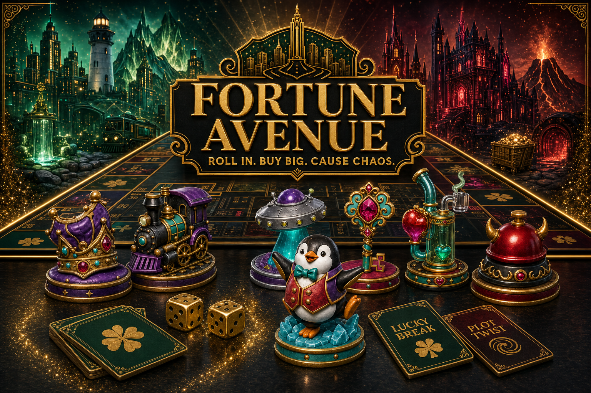
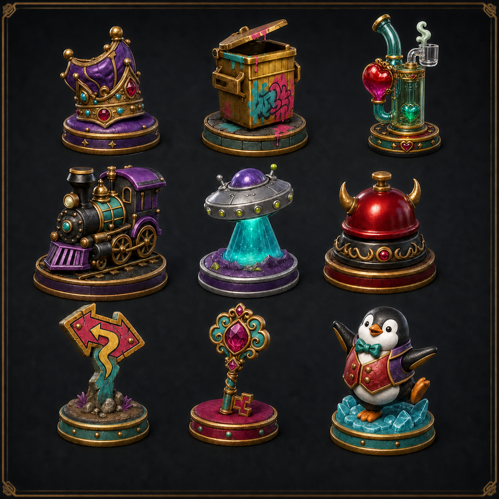

# Fortune Avenue

> Roll in. Buy big. Cause chaos.

[](https://fortune-avenue-live.spotifyps5email.chatgpt.site)

Fortune Avenue is an original physical and browser-playable board game built around strange roadside landmarks, colorful resin pawns, and playful chaos.

## Play now

**[Open the published Fortune Avenue game](https://fortune-avenue-live.spotifyps5email.chatgpt.site)**

- Play immediately with 1–5 autonomous bots.
- Host persistent 2–6 player friend rooms with six-character codes and invite links.
- Leave the page to share an invite, close the tab, or reload; the room and seat reconnect from the same device.
- Choose the Emerald After Dark or Crimson Fantasy board theme.

## What’s included

- Two complete 40-space boards using the same gameplay layout:
  - Emerald Edition — black, emerald, and gold.
  - Crimson Fantasy Edition — black, crimson, and gold.
- 24 original landmark spaces.
- 48 event cards:
  - 24 Lucky Break cards.
  - 24 Plot Twist cards.
- Nine approved colorful resin pawns with front, side, and back sculpt turnarounds.
- Original artwork for landmarks, transportation, services, corners, event spaces, and the web-edition cover.
- A complete browser game with rules, bot decisions, deed ownership, entry fees, upgrades, bankruptcy, animated card reveals, sound cues, and persistent rooms.
- Structured game and pawn data with reproducible Python and web-asset rendering tools.

## View the physical game artwork

### Boards

- [Emerald Edition — full resolution](output/boards/fortune-avenue-emerald-board.png)
- [Crimson Fantasy Edition — full resolution](output/boards/fortune-avenue-crimson-board.png)
- [Emerald Edition — phone preview](output/mobile/fortune-avenue-emerald-board-mobile.jpg)
- [Crimson Fantasy Edition — phone preview](output/mobile/fortune-avenue-crimson-board-mobile.jpg)

### Event cards

- [All 24 Lucky Break cards](output/cards/lucky_break-all-24-cards.png)
- [All 24 Plot Twist cards](output/cards/plot_twist-all-24-cards.png)
- [Lucky Break cards 01–12 — phone page](output/mobile/lucky-break-cards-01-12-mobile.jpg)
- [Lucky Break cards 13–24 — phone page](output/mobile/lucky-break-cards-13-24-mobile.jpg)
- [Plot Twist cards 01–12 — phone page](output/mobile/plot-twist-cards-01-12-mobile.jpg)
- [Plot Twist cards 13–24 — phone page](output/mobile/plot-twist-cards-13-24-mobile.jpg)

### Colorful resin pawns



- [All nine production sheets — high resolution](output/pawns/fortune-avenue-all-nine-pawn-production-sheets.png)
- [All nine production sheets — phone preview](output/pawns/fortune-avenue-all-nine-pawns-mobile.jpg)
- [Individual sculpt production sheets](output/pawns/production-sheets)
- [Pawn dimensions and manufacturing guidance](docs/pawn-production-spec.md)

## Project structure

```text
assets/       Landmark, board-concept, special-space, and pawn artwork
docs/         Landmark roster, pawn specifications, and naming notes
game-data/    Canonical board, event-card, and pawn production data
output/       Boards, cards, mobile previews, and pawn production sheets
tools/        Deterministic physical-game production renderers
web/          Published browser game, room API, optimized art, and tests
itchio/       Branded itch.io HTML launcher and repeatable ZIP builder
```

## Build the itch.io upload

Run `powershell -NoProfile -ExecutionPolicy Bypass -File .\itchio\build-package.ps1`. It creates `releases/Fortune-Avenue-Itchio-v1.0.0.zip`, ready to upload as an itch.io HTML game. The lightweight launcher opens the hosted game so persistent rooms, friend codes, bots, and mobile shake dice continue to work.

## Browser-game validation

From the `web` directory:

```powershell
npm install
npm test
npm run lint
npm run dev
npm run test:live-room
```

The automated suite covers the complete 40-space/48-card/nine-pawn collection, multi-round six-player bot play, social metadata, persistent-room storage, and required assets. The live smoke test creates a friend room, joins a second human seat, starts the game, and reconnects that seat.

## Rebuild the physical exports

Requires Python 3.10 or newer.

```powershell
python -m pip install -r requirements.txt
python tools/render_fortune_avenue.py
python tools/make_mobile_previews.py
python tools/render_pawn_production_sheets.py
```

## Canonical production notes

- “Bicth Valley” is the confirmed intentional Vine/meme spelling.
- `assets/landmarks/06-dab-valley.png` is the selected main Dab Valley artwork.
- `assets/landmarks/01-sheboygan-wisconsin.png` is the selected Sheboygan artwork.
- Earlier visual explorations remain archived beside the canonical landmark files.
