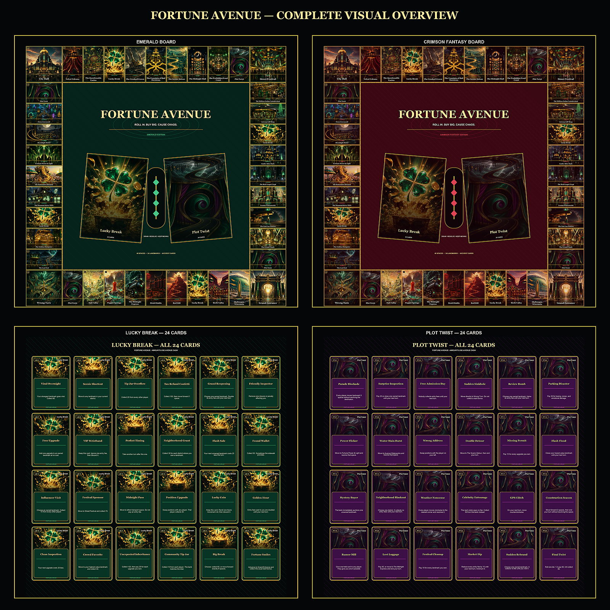

# Fortune Avenue

> Roll in. Buy big. Cause chaos.



Fortune Avenue is an original physical board-game concept built around strange roadside landmarks, playful chaos, and two premium visual editions.

## What's included

- Two complete 40-space boards using the same gameplay layout
  - Emerald Edition — black, emerald, and gold
  - Crimson Fantasy Edition — black, crimson, and gold
- 24 original landmark spaces
- 48 event cards
  - 24 Lucky Break cards
  - 24 Plot Twist cards
- Original artwork for landmarks, transportation, services, corners, and event spaces
- Individual card exports, full deck sheets, high-resolution boards, and phone-friendly previews
- Structured game data and reproducible Python rendering tools

## View the game

### Boards

- [Emerald Edition — full resolution](output/boards/fortune-avenue-emerald-board.png)
- [Crimson Fantasy Edition — full resolution](output/boards/fortune-avenue-crimson-board.png)
- [Emerald Edition — phone preview](output/mobile/fortune-avenue-emerald-board-mobile.jpg)
- [Crimson Fantasy Edition — phone preview](output/mobile/fortune-avenue-crimson-board-mobile.jpg)

### Event cards

- [All 24 Lucky Break cards](output/cards/lucky_break-all-24-cards.png)
- [All 24 Plot Twist cards](output/cards/plot_twist-all-24-cards.png)
- [Lucky Break cards 01–12 — phone page](output/mobile/lucky-break-cards-01-12-mobile.jpg)
- [Lucky Break cards 13–24 — phone page](output/mobile/lucky-break-cards-13-24-mobile.jpg)
- [Plot Twist cards 01–12 — phone page](output/mobile/plot-twist-cards-01-12-mobile.jpg)
- [Plot Twist cards 13–24 — phone page](output/mobile/plot-twist-cards-13-24-mobile.jpg)

Individual print-card images are available under [`output/cards`](output/cards), and the complete landmark artwork collection is under [`assets/landmarks`](assets/landmarks).

## Project structure

```text
assets/       Landmark, board-concept, and special-space artwork
docs/         Landmark roster and naming notes
game-data/    Canonical 40-space layout and all 48 card effects
output/       Full boards, card sheets, individual cards, and mobile previews
tools/        Deterministic board/card renderers
```

## Rebuild the exports

Requires Python 3.10 or newer.

```powershell
python -m pip install -r requirements.txt
python tools/render_fortune_avenue.py
python tools/make_mobile_previews.py
```

The renderer validates the expected 40 board spaces, 24 cards per event deck, required artwork paths, and text-fitting constraints before finishing.

## Canonical production notes

- “Bicth Valley” is the confirmed intentional Vine/meme spelling.
- `assets/landmarks/06-dab-valley.png` is the selected main Dab Valley artwork.
- `assets/landmarks/01-sheboygan-wisconsin.png` is the selected Sheboygan artwork.
- Earlier visual explorations remain archived beside the canonical landmark files.
